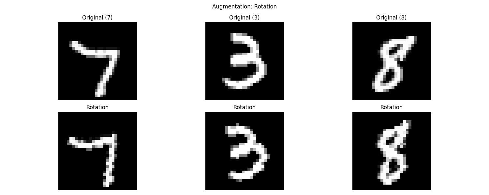
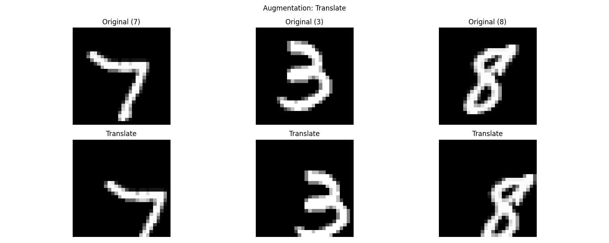
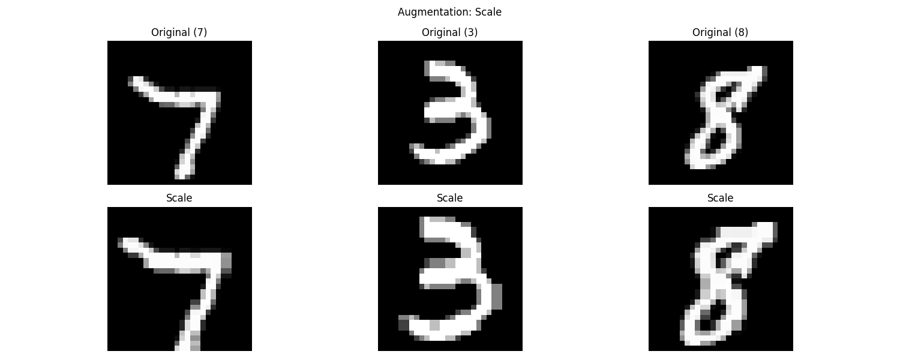
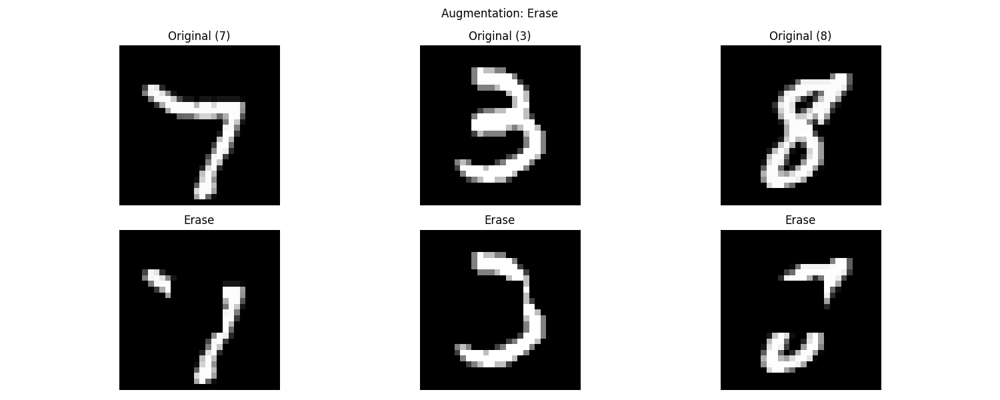

# Lightweight MNIST Classifier

[](https://github.com/ashutoshtiwari05/ERA_Assignment5/actions/workflows/model_test.yml)

This project implements a lightweight neural network for MNIST digit classification that achieves >95% accuracy in just one epoch with less than 25,000 parameters.

## Model Architecture

The model uses a simple CNN architecture:
- 2 Convolutional layers
- 2 Max pooling layers
- 2 Fully connected layers
- Total parameters: ~24,000

## Requirements

- Conda (Miniconda or Anaconda)
- Make (usually pre-installed on Linux/Mac)

## Installation and Setup

1. Install Miniconda (if not already installed):
   - Download from [Miniconda website](https://docs.conda.io/en/latest/miniconda.html)
   - Follow installation instructions for your OS
   - Initialize conda for your shell:
     ```bash
     conda init <your-shell-name>  # e.g., conda init bash or conda init zsh
     ```
   - Restart your terminal

2. Clone the repository:
```bash
git clone <repository-url>
cd <repository-name>
```

3. Create and activate the conda environment:
```bash
make env
conda activate mnist_light
```

## Usage

The project includes a Makefile for easy execution of common tasks:

1. Train the model:
```bash
make train
```

2. Run tests:
```bash
make test
```

3. Run complete workflow (clean, setup env, train, and test):
```bash
make all
```

4. Clean generated files:
```bash
make clean
```

5. Show available commands:
```bash
make help
```

## Model Specifications

- Parameters: <25,000
- Accuracy: >95% in 1 epoch
- Training time: ~2-3 minutes on CPU

## CI/CD

The repository includes GitHub Actions that automatically test:
1. Parameter count constraint (<25,000)
2. Accuracy requirement (>95%)

## Project Structure

```
├── mnist_model.py     # Main model and training code
├── test_model.py      # Test script
├── environment.yaml   # Conda environment specification
├── Makefile          # Build automation
├── .github/workflows  # GitHub Actions configuration
└── README.md         # Documentation
```

## License

MIT

## Data Augmentation Techniques

The model uses several augmentation techniques to improve generalization. Here are examples of each technique:

### 1. Rotation (15 degrees)

- Fixed 15-degree rotation
- Helps model become invariant to rotated digits
- Simulates natural handwriting variations

### 2. Translation (5 pixels)

- Fixed 5-pixel shift
- Makes model robust to digit position changes
- Handles varying digit placements in input

### 3. Scaling (120%)

- Fixed 20% size increase
- Handles different digit sizes
- Improves size invariance

### 4. Random Erasing (Fixed Region)

- Center region erasing
- Simulates occlusions and noise
- Prevents overfitting to specific pixel patterns

### Combined Augmentation Examples

Here are some examples showing all augmentations applied to the same digits:

| Original | Rotated | Translated | Scaled | Erased |
|----------|---------|------------|---------|---------|
|  |  |  |  |  |
|  |  |  |  |  |

Each augmentation technique contributes to making the model more robust and generalizable while maintaining high accuracy with limited parameters. The augmentations are applied during training with the following probabilities:
- Rotation: ±15 degrees (fixed for visualization)
- Translation: 5 pixels in x and y (fixed for visualization)
- Scaling: 120% enlargement (fixed for visualization)
- Erasing: Center region (fixed for visualization)

During actual training, these augmentations are applied randomly with varying parameters to ensure diverse training samples.

## Test Coverage
The model includes comprehensive tests for:
1. Model Requirements
   - Parameter count < 25,000
   - Accuracy > 95%

2. Architecture Tests
   - Input/output shape validation
   - Probability distribution checks
   - Gradient flow verification

3. Robustness Tests
   - Batch size flexibility
   - Noise resistance
   - Dropout consistency
